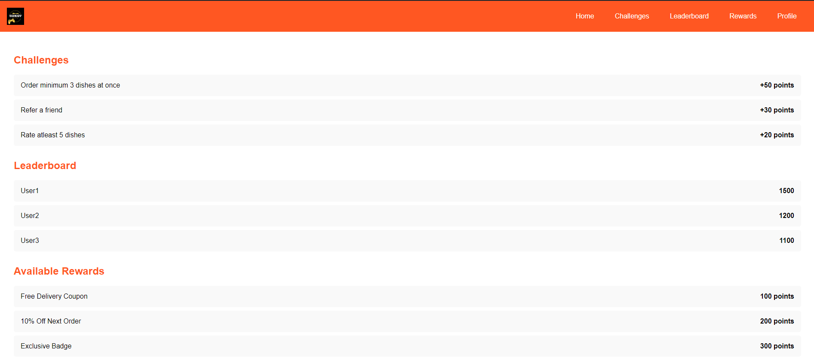

# Gamified-Swiggy
Welcome to the Gamified Swiggy project! This repository contains the design and development of a gamified experience for Swiggy to enhance user engagement and loyalty. The project includes designs for the primary screen and an additional screen, a new logo reflecting the gamified experience, and a promotional Instagram post.

## Project Overview
Features
Primary Screen: Displays daily challenges, reward points, leaderboards, and badges.
Additional Screen: Shows the rewards dashboard or challenge progress.
Logo: A new logo reflecting the playful and engaging nature of the gamified experience.
Instagram Post: Announcing the launch of the gamification feature with key elements highlighted.

## Screenshots

### Primary Screen


### Additional Screen


### Logo


### Instagram Post


## Getting Started
1. Clone the repository:
    ```sh
    git clone https://github.com/your-username/gamified-swiggy.git
    ```
2. Navigate to the project directory:
    ```sh
    cd gamified-swiggy
    ```
    
## Usage
Design Review: Review and implement the designs into your application or website.
Development: Integrate the gamified features into the Swiggy platform.
Promotion: Use the Instagram post design to announce the gamification feature.

## Contributing
If you want to contribute to the project, please fork the repository and create a pull request. Make sure to follow the project's coding standards and guidelines.


